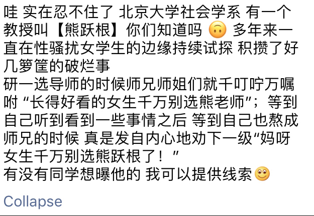

<h1 align="center">
	
	 
	 
</h1>

> 不在沉默中爆发，就在沉默中灭亡。——鲁迅

**人有一个很大的缺陷，就是会选择性的抛弃部分事实来支持自己已有的观点。我们受过教育的人，是要同人类这个固有的缺点抗争的。**

## 目录

- [王攀@武汉理工大学](#wangpan-whut)
- [沈阳@北京大学|南京大学](#shenyang-pku-nju)

## 王攀@武汉理工大学

- [这所211大学突发研究生自杀事件，案件核心人物发声明了！](http://china.huanqiu.com/article/2018-03/11736816.html)：包含受害人家属的回应，以及王攀的回应。

## 沈阳@北京大学|南京大学

- [李悠悠豆瓣原文以及消失，这是一份存档](http://user.guancha.cn/main/content?id=11298&s=fwzxfbbt&page=0)；受害人朋友李悠悠的文章
- [前北大教授被指性侵女生致其自杀 回应：恶意诽谤](http://www.bjnews.com.cn/news/2018/04/05/482133.html)：沈阳的回应

## 熊跃根@北大社会学系

- [熊跃根一直在性骚扰女学生的边缘试探](https://www.douban.com/people/57519876/status/2140400653/)：声称女生不能选熊跃根，声称熊跃根在性骚扰女学生的边缘试探

## 李学尧@上海交通大学凯原法学院

- [关于上海交通大学凯原法学院教授 李学尧的二三事(ZZ)，原文以删除所以只好使用存档](https://kantie.org/topics/mitbbs/31091893)：当事人被李学尧强奸并且强行维持恋爱关系和长期性关系

## 周勇@上财统管学院

- [上财统管学院是院长周勇猎艳的后花园](https://mp.weixin.qq.com/s?__biz=MzI1MzQyNjExNg==&mid=2247484179&idx=1&sn=c86dd7e00324a8de229b02d834d6e05a&chksm=e9d5e3b8dea26aae138d004c5c362346216ce8bfd7c942d952effad8a1881daaca16e4c941aa&mpshare=1&scene=1&srcid=0407oxjoDLZ9IyDyF3EUK6Sq&pass_ticket=8agX8P%2BV7OoMzMT37vKkICEdKSXlOkzQzgm8YdwpktOOc%2BHEm8xOF%2FtOvvs6SpiM&dt_platform=douban_broadcast&dt_dapp=1#rd)：文章说**周勇**利用学术上的便利，除了自己睡学生，也给别的导师（**胡建华**）机会睡学生，还提到了上财法学院的**劳伦斯·米切尔**（**米罗**）在美国猎艳的事情。“周勇对某些女老师也是一样手脚不干净”

