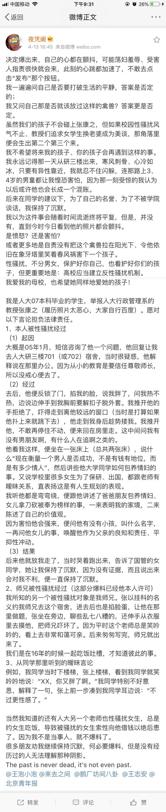

<h1 align="center">
	
	 
	 
</h1>

> 不在沉默中爆发，就在沉默中灭亡。——鲁迅

**人有一个很大的缺陷，就是会选择性的抛弃部分事实来支持自己已有的观点。我们受过教育的人，是要同人类这个固有的缺点抗争的。**

## 目录

- [王攀@武汉理工大学](#王攀武汉理工大学)
- [沈阳@北京大学|南京大学](#沈阳北京大学南京大学)
- [熊跃根@北大社会学系](#熊跃根北大社会学系)
- [李学尧@上海交通大学凯原法学院](#李学尧上海交通大学凯原法学院)
- [周勇@上财统管学院](#周勇上财统管学院)
- [青岛求实职业技术学院](#青岛求实职业技术学院)

## 王攀@武汉理工大学

- [这所211大学突发研究生自杀事件，案件核心人物发声明了！](http://china.huanqiu.com/article/2018-03/11736816.html)：包含受害人家属的回应，以及王攀的回应。

## 沈阳@北京大学|南京大学

- [李悠悠豆瓣原文以及消失，这是一份存档](http://user.guancha.cn/main/content?id=11298&s=fwzxfbbt&page=0)；受害人朋友李悠悠的文章
- [前北大教授被指性侵女生致其自杀 回应：恶意诽谤](http://www.bjnews.com.cn/news/2018/04/05/482133.html)：沈阳的回应
- [现代快报独家对话举报人李悠悠：已联系到受沈阳侵害的另几位女生](http://app.myzaker.com/news/article.php?pk=5ac8976b1bc8e0407f0001d4&dt_platform=douban_broadcast&dt_ref=02b380e3f459aa448e530105625086e91195684e56f41f43b05736aa2fdb8736&dt_dapp=1&dt_dapp=1)：李悠悠的行动
- [人民日报：北京大学通报"沈阳事件"称违反师德 出示当年处理决定+北京大学中文系：关于给予沈阳警告处分的决定](https://www.douban.com/note/664680018/)：北大的行动

## 熊跃根@北大社会学系

- [熊跃根一直在性骚扰女学生的边缘试探](https://www.douban.com/people/57519876/status/2140400653/)：声称女生不能选熊跃根，声称熊跃根在性骚扰女学生的边缘试探
	

	  
截图

		
	

## 李学尧@上海交通大学凯原法学院

- [关于上海交通大学凯原法学院教授 李学尧的二三事(ZZ)，原文以删除所以只好使用存档](https://kantie.org/topics/mitbbs/31091893)：当事人被李学尧强奸并且强行维持恋爱关系和长期性关系

## 周勇@上财统管学院

- [上财统管学院是院长周勇猎艳的后花园](http://blog.sina.com.cn/s/blog_17fe3acb20102xg97.html)[[也有一篇完全相同的微信文章](https://mp.weixin.qq.com/s?__biz=MzI1MzQyNjExNg==&mid=2247484179&idx=1&sn=c86dd7e00324a8de229b02d834d6e05a&chksm=e9d5e3b8dea26aae138d004c5c362346216ce8bfd7c942d952effad8a1881daaca16e4c941aa&mpshare=1&scene=1&srcid=0407oxjoDLZ9IyDyF3EUK6Sq&pass_ticket=8agX8P%2BV7OoMzMT37vKkICEdKSXlOkzQzgm8YdwpktOOc%2BHEm8xOF%2FtOvvs6SpiM&dt_platform=douban_broadcast&dt_dapp=1#rd)]：文章说**周勇**利用学术上的便利，除了自己睡学生，也给别的导师（**胡建华**）机会睡学生，还提到了上财法学院的**劳伦斯·米切尔**（**米罗**）在美国猎艳的事情。“周勇对某些女老师也是一样手脚不干净”

## 张康之@人民大学行政管理系

- 张康之性骚扰学生：原文已经被删除
  - [受害人微博 @夜凭阑 的声明](https://weibo.com/2152968102/GbWP5ykBI)
  - 截图备份：
    

	  
截图备份

		
    

  

## 青岛求实职业技术学院

- [女生被老师带出吃饭坠亡 青岛求实职业技术学院19岁女生刘晓傲](http://www.wenzhousx.com/news/shehui/46681.html)：报道中提到这所学院的三个案例，28岁女教师被奸杀，学生干部跳楼，刘晓傲跳楼。

